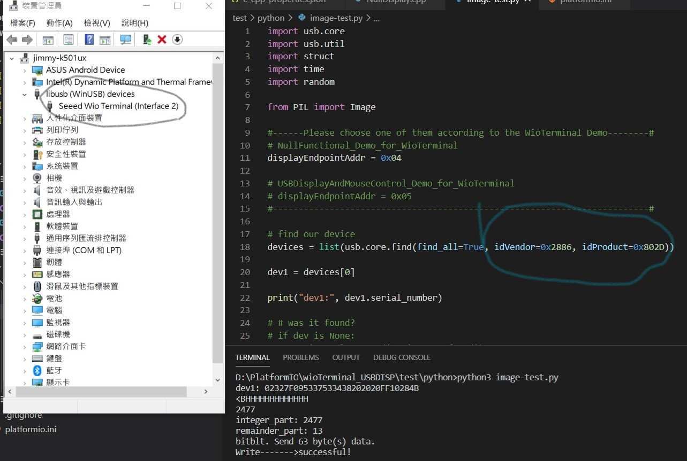
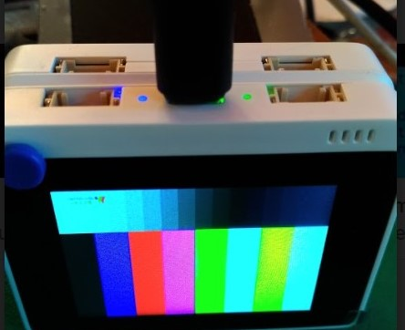

# USB_Display  
Some stuff for the USB Display

 
 

 
 

__Windows setup && Python test__  
Testing Windows user mode SDK w/ Python3... 
   

__USB capture for the 3bytes rpusbdisp-FILL command__ 
  
  

__Test for GIF animation__ SAMD51@200MHz w/o DMA, 320x240/16bit-color@8fps... 
gif from GIPHY:https://giphy.com/explore/donald-trump  
  
https://github.com/jmysu/USB_Display/tree/main/PlatformIO.projects/wioTerminalGifAnimate 
  
__Have fun with SD card slide show (jpg,png,gif)__ 
  
https://github.com/jmysu/USB_Display/tree/main/PlatformIO.projects/wioTerminalSdSlideShow 
  

## References
  - [RoboPeak Mini USB DisplayUSB Interface Protocol Specification](http://www.robopeak.com/data/doc/rpusbdisp/RPUD03-rpusbdisp_interface_protocol-enUS.1.0.pdf) Robopeak USB display protocol PDF.
  - [SeeedWioTerminal UserMode SDK](https://wiki.seeedstudio.com/Wio-Terminal-HMI-Usermode-SDK/) SeeedStudio Wio Terminal SDK.
  - [SeeedWioTerminal USB Display](https://github.com/Seeed-Studio/Seeed_Arduino_USBDISP) Github repository.
  - [Arduino GIF Animator](https://github.com/bitbank2/AnimatedGIF) A lightweight Arduino GIF decoder.
  - [LovYanGFX] (https://github.com/lovyan03/LovyanGFX) Another nice library for Arduino TFT.
