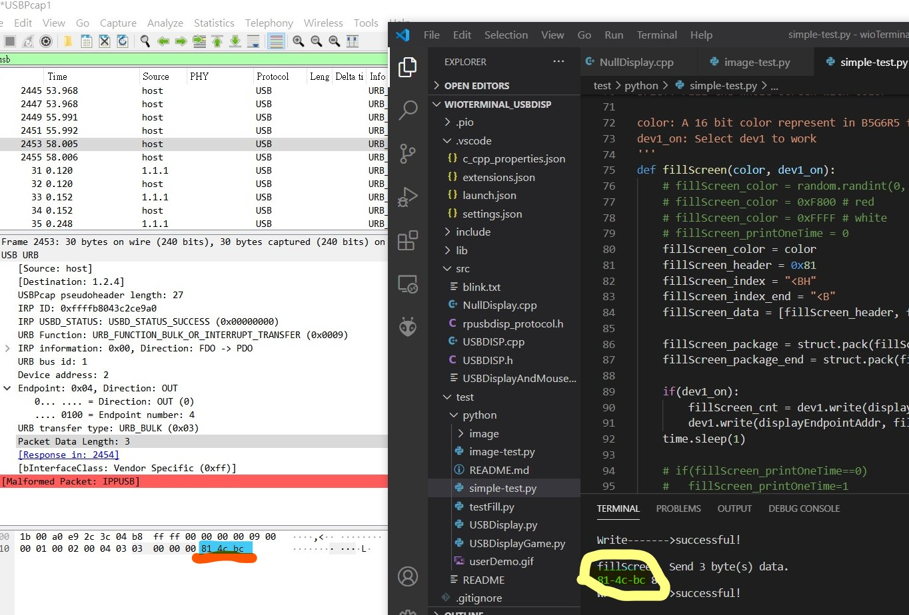

# USB_Display  
Some stuff for the USB Display

 
 

 
 

__Windows setup && Python test__  
Testing Windows user mode SDK w/ Python3... 
   

__USB capture for the 3bytes rpusbdisp-FILL command__ 
  
  

__Test for GIF animation__ w/o DMA, around 8fps... 
https://github.com/jmysu/USB_Display/tree/main/PlatformIO.projects/wioTerminalGifAnimate
  
  

## References
  - [RoboPeak Mini USB DisplayUSB Interface Protocol Specification](http://www.robopeak.com/data/doc/rpusbdisp/RPUD03-rpusbdisp_interface_protocol-enUS.1.0.pdf) Robopeak USB display protocol PDF.
  - [SeeedWioTerminal UserMode SDK](https://wiki.seeedstudio.com/Wio-Terminal-HMI-Usermode-SDK/) SeeedStudio Wio Terminal SDK.
  - [SeeedWioTerminal USB Display](https://github.com/Seeed-Studio/Seeed_Arduino_USBDISP) Github repository.

